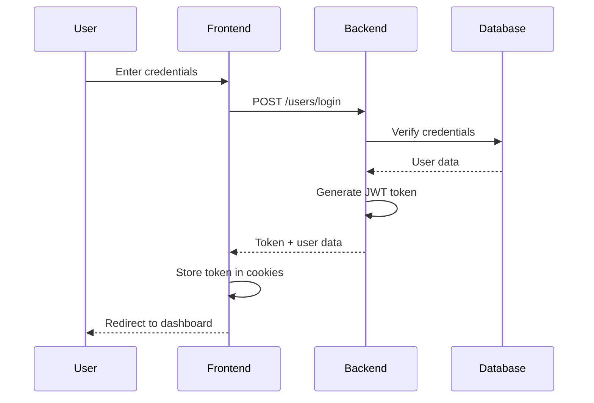
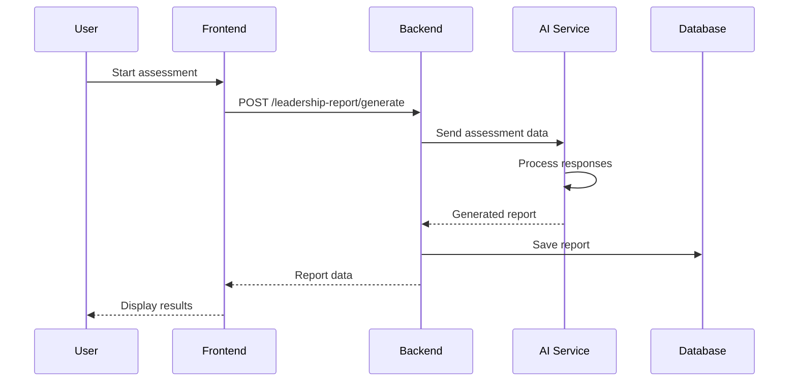
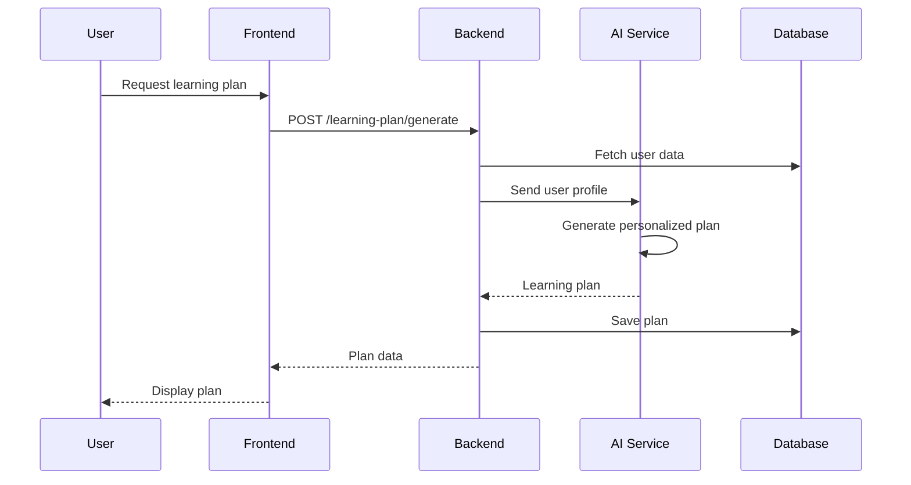

# Thryve Architecture Documentation

## System Overview

Thryve is a multi-tenant leadership development platform built with a modern microservices-inspired architecture. The system is designed to handle multiple organizations, each with their own users, assessments, and learning plans.

## High-Level Architecture

```
┌─────────────────────────────────────────────────────────────────┐
│                        Client Layer                             │
├─────────────────────────────────────────────────────────────────┤
│  Frontend (React)  │  Admin Panel (React)  │  Mobile (Future)   │
└────────────────────┴───────────────────────┴─────────────────────┘
                                    │
                                    ▼
┌─────────────────────────────────────────────────────────────────┐
│                      API Gateway Layer                          │
├─────────────────────────────────────────────────────────────────┤
│                    Express.js Server                            │
│              (Authentication, Rate Limiting, CORS)              │
└─────────────────────────────────────────────────────────────────┘
                                    │
                                    ▼
┌─────────────────────────────────────────────────────────────────┐
│                     Application Layer                           │
├─────────────────────────────────────────────────────────────────┤
│  Controllers  │  Middleware  │  Services  │  Helpers  │  Utils  │
└───────────────┴──────────────┴────────────┴───────────┴─────────┘
                                    │
                                    ▼
┌─────────────────────────────────────────────────────────────────┐
│                       Data Layer                                │
├─────────────────────────────────────────────────────────────────┤
│  MongoDB  │  Cloudinary  │  SendInBlue  │  External APIs       │
└───────────┴──────────────┴──────────────┴───────────────────────┘
```

## Component Architecture

### 1. Frontend Architecture

```
src/
├── components/           # Reusable UI components
│   ├── common/          # Shared components (Header, Sidebar, etc.)
│   ├── home/            # Home page specific components
│   ├── magicui/         # Custom animated UI components
│   ├── onboarding/      # Onboarding flow components
│   ├── skillsassessment/ # Assessment related components
│   └── ui/              # Basic UI primitives
├── pages/               # Page-level components
├── store/               # Redux store configuration
│   ├── index.js         # Store setup
│   ├── rootReducer.js   # Combined reducers
│   └── userSlice.js     # User state management
├── hooks/               # Custom React hooks
├── utils/               # Utility functions
└── lib/                 # Third-party library configurations
```

**State Management Pattern:**
- **Redux Toolkit**: Centralized state management
- **Redux Persist**: Persistent state across sessions
- **Slice Pattern**: Modular state management

### 2. Backend Architecture

```
src/
├── api/                 # Route definitions
│   ├── admin-manager/   # Admin and manager routes
│   ├── chat-box/        # Chat functionality
│   ├── companies/       # Company management
│   ├── feed/            # Feed and content
│   ├── feedback/        # Feedback system
│   ├── goals/           # Goal management
│   ├── health/          # Health checks
│   ├── invite-team/     # Team invitations
│   ├── leadership-report/ # Leadership assessments
│   ├── learning-plan/   # Learning plan generation
│   ├── register/        # Authentication routes
│   └── team-and-manager-score/ # Team scoring
├── controllers/         # Business logic handlers
├── middleware/          # Express middleware
├── helper/              # Helper functions and services
├── migration/           # Database migrations
├── utils/               # Utility functions
└── validators/          # Input validation schemas
```

**API Design Pattern:**
- **RESTful**: Standard HTTP methods and status codes
- **Controller-Service**: Separation of concerns
- **Middleware Chain**: Authentication, validation, rate limiting

## Data Flow Architecture

### 1. Authentication Flow



### 2. Leadership Assessment Flow



### 3. Learning Plan Generation



## Database Architecture

### MongoDB Collections

```javascript
// Users Collection
{
  _id: ObjectId,
  firstName: String,
  email: String,
  phoneNumber: String,
  password: String (hashed),
  role: String, // 'user', 'company-admin', 'founder-admin'
  companyId: ObjectId,
  inviteCode: String,
  createdAt: Date,
  updatedAt: Date
}

// Companies Collection
{
  _id: ObjectId,
  name: String,
  inviteCode: String,
  adminId: ObjectId,
  createdAt: Date,
  updatedAt: Date
}

// Leadership Reports Collection
{
  _id: ObjectId,
  userId: ObjectId,
  companyId: ObjectId,
  assessmentData: Object,
  generatedReport: Object,
  scores: Object,
  createdAt: Date
}

// Learning Plans Collection
{
  _id: ObjectId,
  userId: ObjectId,
  companyId: ObjectId,
  planData: Object,
  progress: Object,
  createdAt: Date,
  updatedAt: Date
}
```

### Indexing Strategy

```javascript
// Primary indexes
db.users.createIndex({ "email": 1 }, { unique: true })
db.users.createIndex({ "companyId": 1 })
db.companies.createIndex({ "inviteCode": 1 }, { unique: true })

// Performance indexes
db.leadershipReports.createIndex({ "userId": 1, "createdAt": -1 })
db.learningPlans.createIndex({ "userId": 1, "createdAt": -1 })
```

## Security Architecture

### Authentication & Authorization

1. **JWT Token Management**
   - Tokens stored in HTTP-only cookies
   - Automatic refresh mechanism
   - Secure token validation

2. **Role-Based Access Control (RBAC)**
   ```javascript
   const roles = {
     'user': ['read:own', 'write:own'],
     'company-admin': ['read:company', 'write:company', 'manage:users'],
     'founder-admin': ['read:all', 'write:all', 'manage:companies']
   }
   ```

3. **Input Validation**
   - Zod schemas for type safety
   - Sanitization of user inputs
   - SQL injection prevention

### Data Protection

1. **Encryption**
   - Passwords hashed with bcryptjs
   - Sensitive data encrypted at rest
   - HTTPS for data in transit

2. **Rate Limiting**
   - API rate limiting per IP
   - Login attempt throttling
   - DDoS protection

## Performance Architecture

### Frontend Optimization

1. **Code Splitting**
   - Route-based code splitting
   - Lazy loading of components
   - Dynamic imports for heavy libraries

2. **Caching Strategy**
   - Redux Persist for state caching
   - Browser caching for static assets
   - Service worker for offline support

3. **Bundle Optimization**
   - Tree shaking for unused code
   - Minification and compression
   - CDN for static assets

### Backend Optimization

1. **Database Optimization**
   - Connection pooling
   - Query optimization
   - Indexing strategy

2. **Caching Layer**
   - Redis for session storage (future)
   - In-memory caching for frequently accessed data
   - CDN for file storage

3. **Load Balancing**
   - Horizontal scaling capability
   - Health checks and failover
   - Auto-scaling configuration

## Scalability Considerations

### Horizontal Scaling

1. **Stateless Design**
   - No server-side session storage
   - JWT-based authentication
   - Shared database access

2. **Microservices Ready**
   - Modular API structure
   - Service separation
   - API gateway pattern

3. **Database Scaling**
   - Read replicas for scaling
   - Sharding strategy
   - Connection pooling

### Monitoring & Observability

1. **Logging Strategy**
   - Winston for structured logging
   - Error tracking and alerting
   - Performance monitoring

2. **Health Checks**
   - API health endpoints
   - Database connectivity checks
   - External service monitoring

## Deployment Architecture

### Development Environment

```
┌─────────────────┐    ┌─────────────────┐    ┌─────────────────┐
│   Frontend      │    │    Backend      │    │   MongoDB       │
│   (Vite Dev)    │◄──►│   (Nodemon)     │◄──►│   (Local)       │
│   Port: 5173    │    │   Port: 5000    │    │   Port: 27017   │
└─────────────────┘    └─────────────────┘    └─────────────────┘
```

### Production Environment

```
┌─────────────────┐    ┌─────────────────┐    ┌─────────────────┐
│   CDN/Proxy     │    │   Load Balancer │    │   MongoDB       │
│   (Static)      │◄──►│   (Nginx)       │◄──►│   (Atlas)       │
└─────────────────┘    └─────────────────┘    └─────────────────┘
                              │
                              ▼
                    ┌─────────────────┐
                    │   App Servers   │
                    │   (PM2 Cluster) │
                    └─────────────────┘
```

## Future Architecture Considerations

### Planned Improvements

1. **Microservices Migration**
   - Service decomposition
   - API gateway implementation
   - Service mesh adoption

2. **Real-time Features**
   - WebSocket integration
   - Real-time notifications
   - Live collaboration

3. **AI/ML Integration**
   - Recommendation engine
   - Predictive analytics
   - Natural language processing

4. **Mobile Application**
   - React Native implementation
   - Offline-first architecture
   - Push notifications

### Technology Evolution

1. **Database Migration**
   - Consider PostgreSQL for complex queries
   - GraphQL for flexible data fetching
   - Event sourcing for audit trails

2. **Cloud Native**
   - Kubernetes deployment
   - Service mesh (Istio)
   - Cloud-native monitoring

This architecture provides a solid foundation for the current requirements while maintaining flexibility for future growth and evolution. 